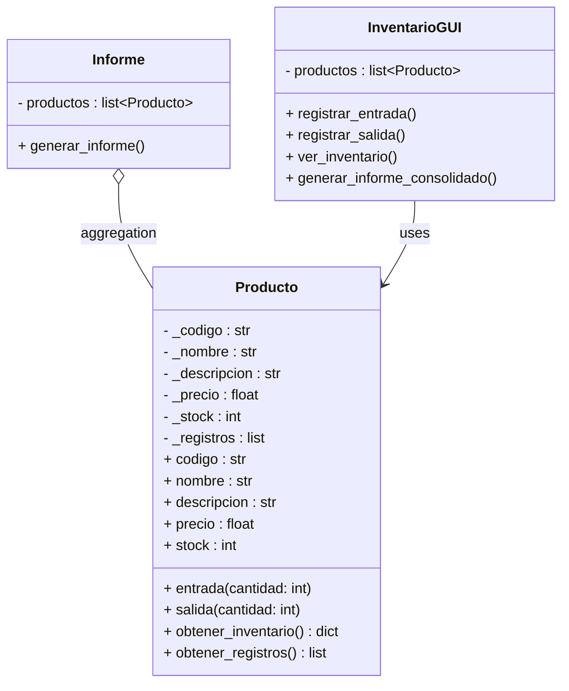

# proyecto_poo_unal
programa gestion inventarios, proyecto poo 

***

```mermaid
classDiagram
    class Producto {
        - _codigo : str
        - _nombre : str
        - _descripcion : str
        - _precio : float
        - _stock : int
        - _registros : list
        + codigo : str
        + nombre : str
        + descripcion : str
        + precio : float
        + stock : int
        + entrada(cantidad: int)
        + salida(cantidad: int)
        + obtener_inventario() dict
        + obtener_registros() list
    }

    class Informe {
        - productos : list~Producto~
        + generar_informe()
    }

    class InventarioGUI {
        - productos : list~Producto~
        + registrar_entrada()
        + registrar_salida()
        + ver_inventario()
        + generar_informe_consolidado()
    }

    Informe o-- Producto : aggregation
    InventarioGUI --> Producto : uses
```
