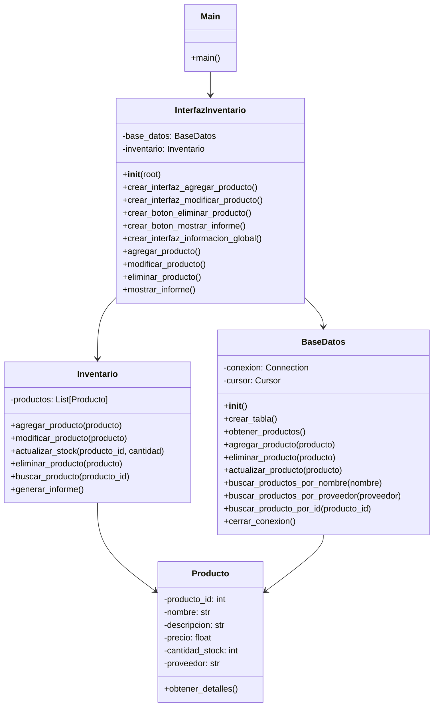

# proyecto_poo_unal
Proyecto poo, Entre las opciones planteadas se opto por el desarrollo de una aplicación que emule un sistema de gestión de inventario para una bodega utilizando Python, tomando tambien el plateamiento de que la aplicacion tenga una interfaz grafica GUI,  y el manejo de inventario mediante una base de datos , como primer medida pasamos a desarrollar nuestro diagrama de clases. 

# DIAGRAMA DE CLASES

***


-----------------------------------------------------------------------------
# Integración Modular de los Componentes

El diseño modular de la aplicación se ha estructurado cuidadosamente para garantizar una separación clara de responsabilidades entre los diferentes módulos. A continuación se explica cómo cada componente contribuye al funcionamiento del sistema y cómo interactúan entre sí.

# Principal (main.py)

Este módulo es el punto de entrada de la aplicación. Su principal tarea es inicializar la ventana raíz de Tkinter y crear una instancia de la clase InterfazInventario. Esto establece la interfaz gráfica y proporciona el enlace entre el usuario y la lógica del inventario, asegurando que la aplicación esté lista para manejar las interacciones del usuario.

# InterfazInventario (interfazinventario.py)

InterfazInventario es el núcleo de la interfaz gráfica de la aplicación, gestionando todas las interacciones del usuario con el sistema. Proporciona los métodos para crear elementos de la interfaz (como formularios, botones y cuadros de texto) y maneja las acciones del usuario, como agregar, modificar o eliminar productos.

Este módulo se integra con dos componentes clave:

BaseDatos: para gestionar la persistencia de datos en la base de datos.
Inventario: para manejar la colección de productos en memoria y sus operaciones, como actualizar el stock o generar informes.
Gracias a esta integración, InterfazInventario coordina de manera efectiva las acciones del usuario, la manipulación de datos y la actualización de la interfaz gráfica.

# BaseDatos (bdd.py)

BaseDatos es responsable de gestionar todas las operaciones de persistencia a través de SQLite. Proporciona métodos para crear tablas, y realizar operaciones CRUD (crear, leer, actualizar y eliminar) sobre los productos.

Este módulo es utilizado por InterfazInventario para:

Garantizar la persistencia para los datos de productos cuando se añaden, modifican o eliminan.
Recuperar información actualizada sobre los productos para su visualización y gestión en la interfaz.
Al encapsular todas las operaciones de base de datos, se asegura que los datos del inventario sean consistentes y se almacenen correctamente.

# Inventario (inventario.py)

Este módulo se encarga de la gestión de la colección de productos en memoria. La clase Inventario proporciona métodos para agregar, modificar, actualizar stock y eliminar productos. También incluye un método para generar informes de inventario, lo que permite revisar el estado actual de los productos y sus movimientos.

Inventario se utiliza para mantener una representación actualizada y en tiempo real del inventario, lo que permite a la aplicación funcionar incluso si hay problemas temporales con la base de datos.

# Producto (producto.py)

La clase Producto define la estructura de los productos individuales en el inventario. Utiliza decoradores de propiedades para garantizar un acceso controlado y seguro a los atributos de cada producto, como el código, nombre, descripción, precio, y stock.

Tanto Inventario como BaseDatos trabajan con instancias de la clase Producto, lo que asegura una representación consistente de los productos en todos los módulos de la aplicación. Producto también incluye métodos para proporcionar información detallada de cada artículo, facilitando la interacción y administración de productos a nivel de inventario y base de datos.

# Integración de Módulos

Principal (main.py): Inicializa la interfaz gráfica creando una instancia de InterfazInventario, lo que da inicio al ciclo de la aplicación.
InterfazInventario (interfazinventario.py): Es el punto central de integración. Este módulo conecta la lógica de la interfaz de usuario con las operaciones de base de datos (a través de BaseDatos) y la gestión del inventario en memoria (a través de Inventario).
BaseDatos (bdd.py): Se encarga de la persistencia de datos, almacenando y recuperando información sobre los productos desde la base de datos.
Inventario (inventario.py): Mantiene la informacion de productos en memoria, gestionando el estado actual del inventario.
Producto (producto.py): Representa individualmente cada producto, y sus instancias son utilizadas por InterfazInventario, BaseDatos e Inventario para asegurar la consistencia de los datos.


Este diseño modular permite una separación clara de responsabilidades:

InterfazInventario maneja toda la lógica de la interfaz de usuario.

BaseDatos encapsula las operaciones de base de datos.

Inventario gestiona el estado del inventario en memoria.

Producto proporciona la estructura de datos para cada producto.

Esta separación hace que la aplicación sea fácil de mantener y escalar. Cada componente puede ser actualizado o reemplazado sin afectar a los demás, facilitando la mejora y el mantenimiento a largo plazo del sistema.


_____________________________________________________________________________________________________________________________________


La aplicacion es funcional para windows ya que las versiones de python cuentan con la biblioteca tkinter instalada por defecto, para usarse en linux dependera de la distribucion y la version de python, si no se cuenta con la bibilioteca tkinter   basta con seguir las siguientes instrucciones  en la terminal para poder instalarlo, posterior a ello la aplicacion debe correr y mostrarla interfaz grafica  
```
Para validar si se cuenta con tkinter instalado
    python3 --version
    python3 -m tkinter

Para distribuciones basadas en Debian (Ubuntu, LinuxMint, etc):
    sudo apt install python3-tk

Para distribuciones basadas en RHEL (Fedora, CentOS, etc)
    sudo dnf install python3-tkinter

Para distribuciones basadas en OpenSuse:
    sudo zypper in python3-tk
```
---------------------------
# Referencias

https://github.com/fegonzalez7/poo_unal_clase1 (contenido de los repositorios publicados)

https://www.freecodecamp.org/espanol/news/python-decorador-property/#:~:text=El%20decorador%20%40property%20es%20un,usar%20propiedades%20en%20una%20clase.

https://medium.com/@solidlucho/tkinter-crea-interfaces-gr%C3%A1ficas-en-python-de-forma-sencilla-50d131f84883

https://www.youtube.com/watch?v=MpkTYMzhV0A

https://docs.hektorprofe.net/python/interfaces-graficas-con-tkinter/widget-button-boton/

https://es.stackoverflow.com/questions/312284/c%C3%B3mo-instalo-tkinter-en-python-3

https://www.youtube.com/watch?v=8L5JFlxTcWg

https://www.youtube.com/watch?v=AGw1A4L3Bhs

https://www.youtube.com/watch?v=LfSGeCt50Z0

https://noviello.it/es/como-instalar-python-tkinter-en-linux/

https://es.py4e.com/html3/15-database

https://www.google.com/search?q=bases+de+datos+en+python&rlz=1C1FKPE_esCO1093CO1093&oq=bases+de+datos+en+python&gs_lcrp=EgZjaHJvbWUyDggAEEUYORhDGIAEGIoFMggIARAAGBYYHjIICAIQABgWGB4yCAgDEAAYFhgeMggIBBAAGBYYHjIICAUQABgWGB4yCAgGEAAYFhgeMggIBxAAGBYYHjIKCAgQABgPGBYYHjIICAkQABgWGB7SAQkxMzg4N2owajeoAgCwAgA&sourceid=chrome&ie=UTF-8#fpstate=ive&vld=cid:b7c68249,vid:iH7d2vHVCUk,st:0

https://docs.python.org/es/3.8/library/sqlite3.html
