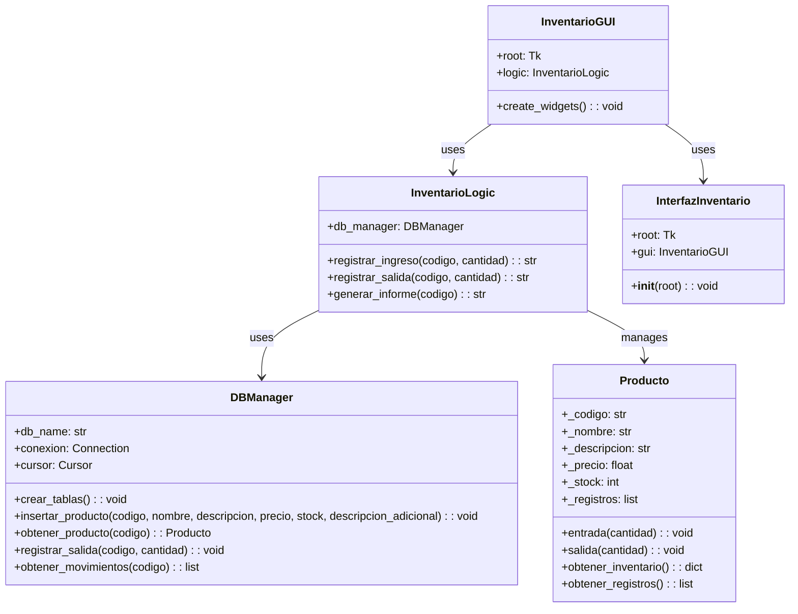

# proyecto_poo_unal
Proyecto poo, Entre las opciones planteadas se opto por el desarrollo de una aplicación que emule un sistema de gestión de inventario para una bodega utilizando Python, tomando tambien el plateamiento de que la aplicacion maneje una interfaz grafica GUI,  y la opcion de  generar informes de los inventarios en un archivo txt, como primer medida pasamos a desarrollar nuestro diagrama de clases. 

DIAGRAMA DE CLASES

***


La solución se diseñó con una estructura modular para separar el manejo de inventarios,  de la interfaz de usuario, facilitando la escalabilidad y el mantenimiento del sistema.

Basado en 4 aspectos

Gestión de Productos: Es necesario un sistema para almacenar y gestionar información sobre productos, como el código, nombre, descripción, precio y la cantidad en inventario.

Registro de Entradas y Salidas: Se requiere la capacidad de registrar la entrada (adición de stock) y salida (reducción de stock) de productos en el inventario.

Generación de Informes: Es fundamental poder generar informes consolidados que documenten todas las transacciones de entrada y salida de los productos.

Interfaz de Usuario:  Se necesita una interfaz gráfica que permita a los usuarios interactuar con el sistema de manera intuitiva, facilitando la introducción de datos y la obtención de informes

-----------------------------------------------------------------------------
Estructura Modular de la aplicacion
Para abordar el problema de manera efectiva, se desarrollaron varios módulos, cada uno con responsabilidades específicas:

1. Módulo Producto
Funcionalidad: Este módulo es el responsable de la lógica relacionada con los productos. Cada instancia de la clase Producto representa un producto en el inventario.
Componentes Principales:
Atributos Privados:
_codigo: Código único del producto.
_nombre: Nombre del producto.
_descripcion: Descripción del producto.
_precio: Precio del producto.
_stock: Cantidad disponible en inventario.
_registros: Lista de transacciones (entradas y salidas) asociadas al producto.
Métodos Públicos:
entrada(cantidad): Registra una entrada de stock para el producto.
salida(cantidad): Registra una salida de stock, disminuyendo la cantidad disponible.
obtener_inventario(): Devuelve un diccionario con la información actual del producto.
obtener_registros(): Retorna la lista de transacciones asociadas al producto.
codigo y nombre: Propiedades para acceder al código y nombre del producto.

Este módulo se encarga de:
Gestionar la información y operaciones relacionadas con un producto individual.
Almacenar un historial de transacciones (entradas y salidas).
______________________________________________________________________________
2. Módulo Informe
Funcionalidad: Este módulo se encarga de la generación de informes de inventario. Recibe una lista de productos y genera un archivo de texto con la información de todas las transacciones.
Componentes Principales:
Método Principal:
generar_informe(): Genera un informe consolidado en un archivo de texto (Informe_Inventario.txt), detallando las transacciones de todos los productos.

Este módulo se encarga de:
Consolidar y presentar la información de las transacciones de productos en un formato legible y persistente.
_______________________________________________________________________________
3. Módulo InventarioGUI (Integración con Tkinter)
Funcionalidad: Este módulo es responsable de la interfaz gráfica de usuario (GUI). Utiliza Tkinter para crear un entorno visual que permite al usuario interactuar con el sistema de inventario.
Componentes Principales:
Interfaz de Usuario:
Ventana principal (root): Donde se alojan todos los elementos de la GUI.
Formularios (Entry): Campos de entrada para ingresar datos del producto.
Botones (Button): Para ejecutar las diferentes operaciones (registrar entrada/salida, ver inventario, generar informes).
Métodos Principales:
registrar_entrada(): Captura los datos ingresados en la GUI y los utiliza para registrar una entrada de producto.
registrar_salida(): Captura los datos ingresados en la GUI y los utiliza para registrar una salida de producto.
ver_inventario(): Muestra el inventario actual en un cuadro de mensaje.
generar_informe_consolidado(): Genera un informe consolidado de todas las transacciones.

Este módulo se encarga de:
Facilitar la interacción del usuario con el sistema de inventario mediante una interfaz gráfica.
Conectar la lógica de Producto e Informe con los elementos visuales, permitiendo la gestión del inventario de manera facil e intuitiva.

-----------------------------------------------------------------------------------------------
Integración de los Módulos

InventarioGUI interactúa directamente con los módulos Producto e Informe. Este módulo es el encargado de recibir la informacion del usuario a través de la interfaz gráfica, y luego llamar a los métodos apropiados en Producto o Informe para realizar la tarea solicitada.

Producto es la clase donde se maneja la lógica relacionada con cada artículo del inventario, como la actualización de stock y el almacenamiento de registros de transacciones.

Informe toma todos los productos manejados por la interfaz gráfica y genera un informe detallado en un archivo de texto, lo que facilita la revisión de las operaciones realizadas.

-----------------------------------
La aplicacion es funcional para windows ya que las versiones de python cuentan con la biblioteca tkinter instalada por defecto, para usarse en linux dependera de la distribucion y la version de python, si no se cuenta con la bibilioteca tkinter   basta con seguir las siguientes instrucciones  en la terminal para poder instalarlo, posterior a ello la aplicacion debe correr y mostrarla interfaz grafica  
```
Para validar si se cuenta con tkinter instalado
    python3 --version
    python3 -m tkinter

Para distribuciones basadas en Debian (Ubuntu, LinuxMint, etc):
    sudo apt install python3-tk

Para distribuciones basadas en RHEL (Fedora, CentOS, etc)
    sudo dnf install python3-tkinter

Para distribuciones basadas en OpenSuse:
    sudo zypper in python3-tk
```
---------------------------
Referencias

https://github.com/fegonzalez7/poo_unal_clase1 (contenido de los repositorios publicados)

https://www.freecodecamp.org/espanol/news/python-decorador-property/#:~:text=El%20decorador%20%40property%20es%20un,usar%20propiedades%20en%20una%20clase.

https://medium.com/@solidlucho/tkinter-crea-interfaces-gr%C3%A1ficas-en-python-de-forma-sencilla-50d131f84883

https://www.youtube.com/watch?v=MpkTYMzhV0A

https://docs.hektorprofe.net/python/interfaces-graficas-con-tkinter/widget-button-boton/

https://es.stackoverflow.com/questions/312284/c%C3%B3mo-instalo-tkinter-en-python-3

https://www.youtube.com/watch?v=8L5JFlxTcWg

https://www.youtube.com/watch?v=AGw1A4L3Bhs

https://www.youtube.com/watch?v=LfSGeCt50Z0

https://noviello.it/es/como-instalar-python-tkinter-en-linux/
