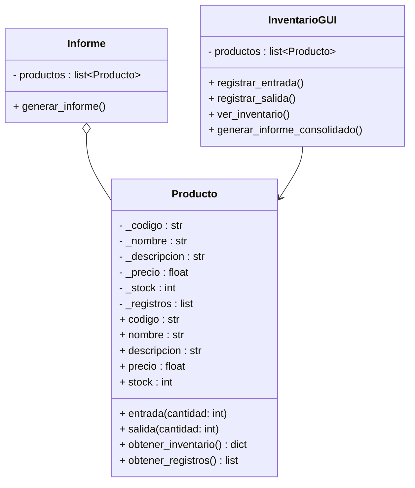

# proyecto_poo_unal
Proyecto poo, Entre las opciones planteadas se opto por el desarrollo de una aplicación que emule un sistema de gestión de inventario para una bodega utilizando Python, tomando tambien el plateamiento de que la aplicacion maneje una interfaz grafica GUI, para lo cual se hizo uso de tkinter la cual se desglosa a detalle mas adelante, y tambien la opcion de un modulo que genera informes de los productos en un archivo txt, como primer medida pasamos a desarrollar nuestro diagrama de clases. 

DIAGRAMA DE CLASES

***

